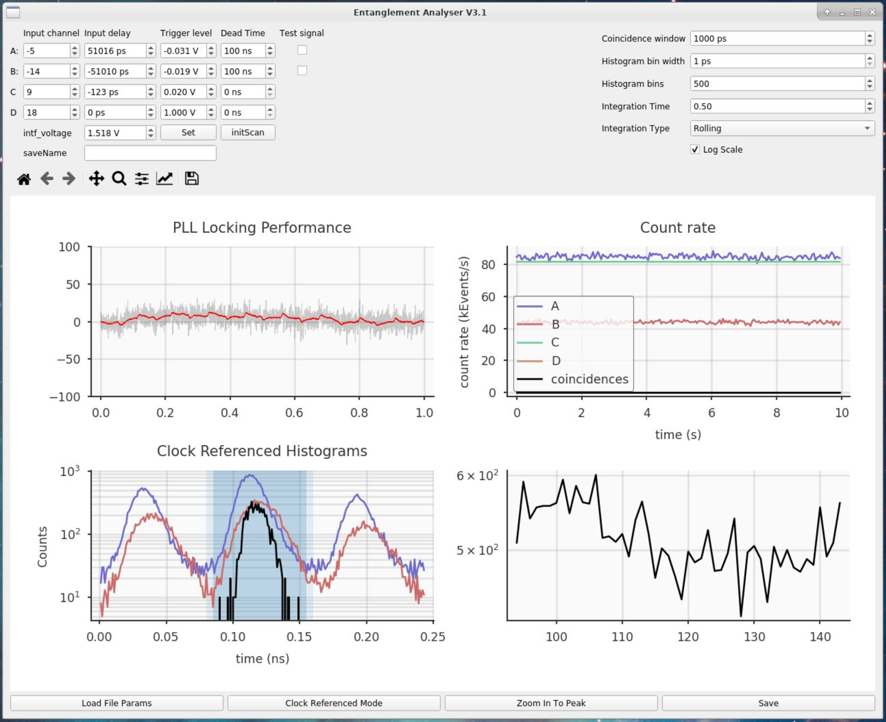

# High Rate Entanglement PySide2 Software

This software is used measure coincidences and control the high rate entanglement experiment based on a fast mode locked laser. 



## Getting Started

1. Install the [swabian timetagger software](https://www.swabianinstruments.com/time-tagger/downloads/)
    - On redhat, navigate to the location of the file and install with:
    ```
    sudo yum install name-of-timetagger-file.rpm
    ```
    - The example files are located in ``` /lib64/timetagger ```
    - The installation will put some timetagger specific files in the site-packages folder of one of the computer's python installations. You will need to find them. You can try looking in folders like these, change ```python3.6``` to the default version on the system.
    ```
    /usr/lib/python3.6/site-packages/
    /usr/lib64/python3.6/site-packages/
    ```

    The files (as of Timetagger software version 2.13.2) include: 
    ```shell
    TimeTagger.py
    _TimeTagger.cxx
    _TimeTagger.h
    _TimeTagger.so
    ```

    Note down the path to these files, and save for later. I'll call this ```<default-python-path>```
    

2. Using anaconda, run the following in shell: 
```shell
conda env create -f environment.yaml
```

3. After that is finished, activate the environment:
```shell
conda activate entanglement
```

4. You will need to copy the files from step 1 into the new entanglement environment site-packages folder. With the ```entanglement``` environment activated, run the ```get_site_packages.py``` script and note the path in the output. I'll call this path ```<entanglement-path>```.

Run the following commands, inserting the relevant paths. 

```shell
cd <default-python-path> 
sudo cp TimeTagger.py <entanglement-path> 
sudo cp _TimeTagger.cxx <entanglement-path>
sudo cp _TimeTagger.h <entanglement-path>
sudo cp _TimeTagger.so <entanglement-path>
```

Navigate back to the program directory: 
```shell
cd <entanglement-path>
```

run the program with:
```shell
python entanglement_control.py
```

Hit the "Load File Params" button first, then the "Clock Referenced Mode" button to activate the PLL. 


## Notes and Tips

- Lower the count rate if you get an error similar to ```SWIG director method error. In method 'next_impl': ZeroDivisionError```

- The button for Clock Referenced Mode engages the the software defined PLL. After pressing this, select 'Zoom to Peak' to scan in time for the entangled photon pairs coincidence peak. This button should also center the largest time bin in the center of the histogram on the lower left. 

- Some fields in the gui may not be used, like the saveName dialogue. You can hook into these gui features by customizing the code if you wish. (I often rename buttons in ```entanglement_control_window.py``` and re-assign them to point to differnt functions.)